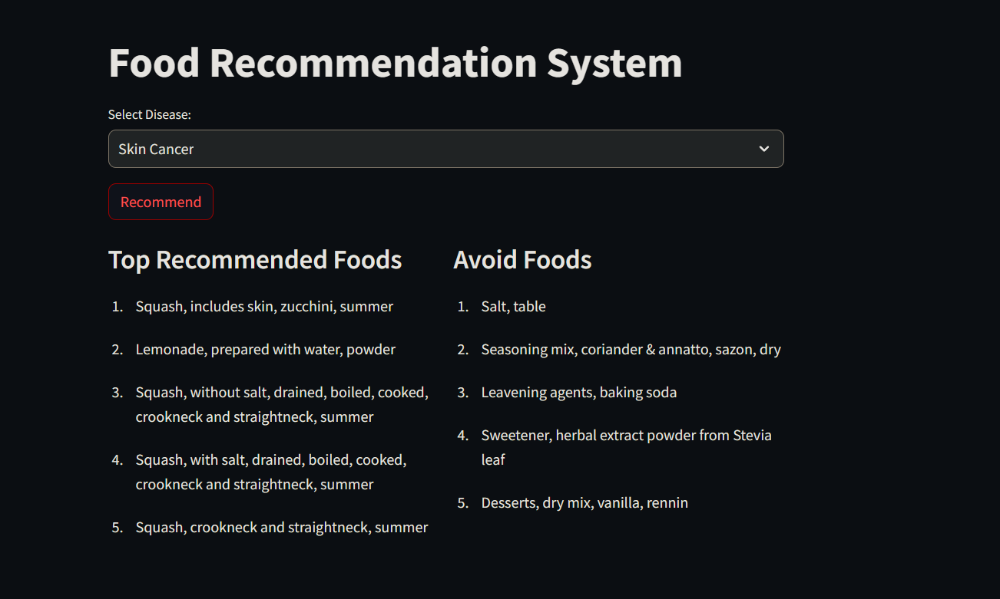

# Food Recommendation System
<div style="text-align: center;">
  
</div>

#### Dependencies
To install the required Python packages you can use the following command:

```bash
pip install -r requirements.txt
```
<hr>

- Run `Datapreprocessing.ipynb` and `model.ipynb` to generate:

    - preprocessed_food.csv
    - preprocessed_disease.csv
    - similarity_scores.pkl
    - disease.pkl
    - food.pkl

- Run `main.py` 
```bash
streamlit run main.py
```